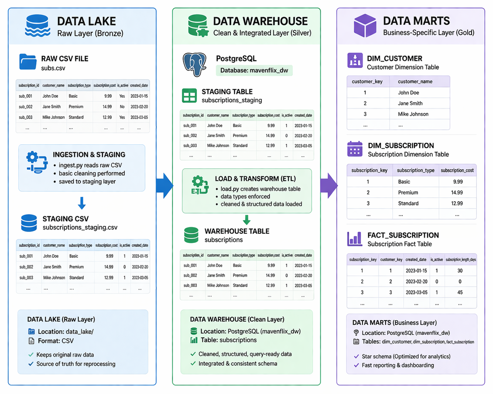

# Streaming Video Subscriptions (MavenFlix) — Data Lake → Warehouse → Data Marts

This project builds a simple analytics pipeline for **MavenFlix**, a fictitious video streaming platform.

The dataset contains ~2,900 subscriber subscription records from **September 2022 through September 2023**. Each record represents a customer subscription including subscription cost, created/canceled dates, billing interval, and payment status.

## Architecture Overview

This repo is organized as a small end-to-end pipeline:

- **Data Lake (Raw Zone)**: raw CSV files (source-of-truth extracts)
- **Staging (Clean Zone)**: cleaned CSV output ready to load
- **Data Warehouse**: PostgreSQL database containing a staging table for the cleaned data
- **Data Marts**: curated **dimension** and **fact** tables for reporting and analysis

## Data Flow Summary

Raw CSV → `ingest.py` → cleans data → writes a staging CSV  
Staging CSV → `load.py` → loads into a warehouse staging table  
Warehouse staging → `load_datamart.py` → builds dimension + fact tables (data marts)

## Scripts

### 1) `ingest.py`
**Purpose**: Pull raw data, clean it, and prepare it for loading into the warehouse.

**Key steps**
- Reads raw CSV: `Subscription Cohort Analysis Data.csv`
- Converts date columns to datetime
- Creates new features:
  - `is_active`: whether subscription is still ongoing
  - `subscription_length_days`: duration of subscription
- Saves cleaned data to:
  - `data/staging/cleaned_subscriptions.csv`

**Output**
- Cleaned staging CSV, ready for warehouse ingestion

---

### 2) `load.py`
**Purpose**: Load the cleaned staging CSV into the PostgreSQL warehouse.

**Key steps**
- Reads `data/staging/cleaned_subscriptions.csv`
- Optionally converts Yes/No columns to 1/0
- Connects to PostgreSQL (example DB: `mavenflix_dw`)
- Loads data into the warehouse staging table:
  - `subscriptions_staging`

**Output**
- Data available in the warehouse staging table (`subscriptions_staging`)

---

### 3) `check_columns.py`
**Purpose**: Quickly inspect the CSV before loading or transformations.

**Key steps**
- Reads the CSV
- Prints all column names
- Prints the first 5 rows for sanity checks

**Output**
- Helps verify data structure (useful for debugging missing columns / schema mismatch)

---

### 4) `load_datamart.py`
**Purpose**: Build your data marts from the staging table.

**Key steps**
- Reads `subscriptions_staging` from PostgreSQL
- Creates dimension tables:
  - `dim_customer`: unique customers
  - `dim_subscription`: subscription attributes
- Creates fact table:
  - `fact_subscription`: subscription activity with measures (e.g., length, payment status)
- Writes marts back into PostgreSQL (same database)

**Output**
- Data marts in PostgreSQL:
  - `dim_customer`
  - `dim_subscription`
  - `fact_subscription`

## Known Issue: `load_datamart.py` column mismatch

If you run `load_datamart.py` and see an error like:

`KeyError: "['customer_name', 'customer_email'] not in index"`

It happens because the staging CSV does **not** contain `customer_name` or `customer_email`. The dataset only includes `customer_id` (plus subscription fields).

**Fix**
- Update the datamart build logic to use the columns that actually exist in the staging table, or remove fields like `customer_name` / `customer_email` from the dimension design unless you have a separate customer source dataset.

## Recommended Analysis

### 1) Subscription trends over time
- New subscriptions per month (from `created_date`)
- Cancellations per month (from `canceled_date`)
- Active subscribers over time (`is_active` + date logic)

### 2) % of customers subscribed for 5+ months
- Use `subscription_length_days` (or compute duration using `created_date` and `canceled_date`)
- Convert to months and compute percentage >= 5 months

### 3) Retention (best/worst months)
- Cohort by `created_month`
- Measure retention across subsequent months
- Identify highest and lowest cohort retention

## Disclaimer
MavenFlix is fictitious and the dataset is intended for analytics practice.